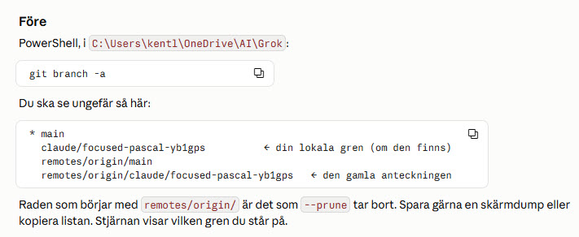
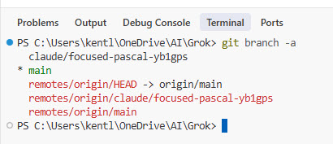
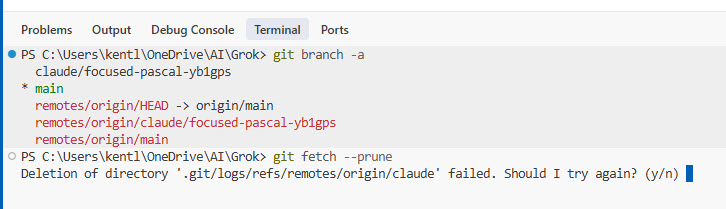
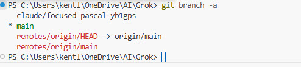

# Skills i repot – så hålls de lika i Grok, Cursor, Claude och andra

Den här filen beskriver hur skills hanteras i `kentlundgren/Grok`: vad som är original, kopia och pekare, vad som är gjort, och steg för steg hur man ändrar och synkar dem. Den är skriven för ägaren (Kent) att läsa nu och senare. Ingen live-sida: mappen är en arbetsmapp för agenter.

Skriven av Claude Code (Sonnet 5.5), 2026-10-05. Ägaren granskar. Där något inte är verifierat står det.

---

## 1. Målet

1. Skills ska säga **samma sak** oavsett vilket verktyg som läser dem: Grok, Cursor, Claude Code och, vid behov, ChatGPT och Gemini.
2. Varje skill ska ha **ett original**. Allt annat är en kopia eller en pekare, och märks så.
3. Ägaren ska kunna **göra processen själv**, utan att gissa var något ligger.

Bakgrund: `AGENTS.md` säger att samma regel inte ska skrivas på flera ställen (avsnittet "Om du tar över mitt i arbetet", punkt 6). Skills som driver isär är det som `ai-minne-formagor-organisation` varnar för.

---

## 2. Tre begrepp

| Begrepp | Vad det är | Exempel |
| --- | --- | --- |
| **Original** | Den enda text som gäller. Ändra den först. | Groks interna skill `controllerrollen-generativ-ai` |
| **Kopia** | En avstämd kopia av originalet, lagd i repot (här i `.agents/skills/`, ett äldre mönster, se avsnitt 3). Märkt som kopia, med avstämningsdatum. | `.agents/skills/controllerrollen-generativ-ai/` |
| **Pekare** | En liten fil som bara säger "läs kopian där". Innehåller ingen regel. | `.claude/skills/controllerrollen-generativ-ai/SKILL.md` |

Regeln: **originalet först, kopian efteråt, pekaren ändras sällan.** Skriv aldrig om en regel i kopian på egen hand.

---

## 3. Var verktygen läser

Enligt `AGENTS.md` (avsnittet "Skills: var de ska ligga") gäller:

| Verktyg | Läser | Kommentar |
| --- | --- | --- |
| Claude Code och Cursor | `.claude/skills/` | Huvudregeln i `AGENTS.md`: skills ligger direkt under repots rot i `.claude/skills/<namn>/`. |
| Grok Build | `.grok/skills/` | Enligt `AGENTS.md` listar xAI:s dokumentation `.grok/skills/`. Vill man att Grok Build ska använda en skill lägger man en tunn pekare där. |
| Det här repot (original och kopior) | `.agents/skills/` | Äldre mönster, som repot använder idag. Mappstrukturen i `AGENTS.md` kommenterar den fortfarande som "Skill som Cursor och Grok hittar själva", men avsnittet "Skills: var de ska ligga" säger att det inte är verifierat för Grok. Claude Code läser den inte direkt, utan via pekarna i `.claude/skills/` (enligt pekarfilen för `koldioxidlagring-villkor`: Claude Code läser bara från `.claude/skills/`). |
| Grok (kontonivå) | Groks eget lager, inte en mapp i repot | Enligt Groks utskrift 2026-10-05 (frågan "grok inspect" ställd i chatten, inte som kommando) finns 49 "account skills", skilda från projektets skills i `.grok/skills/`. Där ligger originalen av `ai-minne-formagor-organisation`, `controllerrollen-generativ-ai` och `kodsatt-agentic-engineering`, och även en egen kopia av `generativ-ai-privat-och-professionellt` (version okänd). Var lagret ligger på datorn eller kontot är inte känt. |
| ChatGPT, Gemini | Ingen automatisk läsning beskriven här | Controller-skillen säger att filen kan läggas i projektinstruktion, Gem eller custom instructions. Rollen för ChatGPT och Gemini är inte beskriven i `AGENTS.md`. Fråga ägaren, gissa inte. |

**Det här repots skills följer ett äldre mönster.** De ligger i `.agents/skills/` med pekare i `.claude/skills/`. `AGENTS.md` säger att det mönstret är äldre, och att det inte är verifierat att Grok hittar `.agents/skills/` på projektnivå. Innan mönstret kopieras till en ny skill bör det kontrolleras. Vad `grok inspect` är som kommando är **inte verifierat**: när det skrevs i Groks chatt svarade Grok att `grok` inte var installerat i den sessionen och gjorde en egen genomgång av sin arbetsyta, som inte gällde det här repot. Pröva `grok --help` i PowerShell (se avsnitt 7).

Det betyder att pekarna i `.claude/skills/` är det som verkligen läses av Claude Code, medan kopian i `.agents/skills/` är där texten bor. **Verifierat 2026-10-05:** en Claude Code-session i molnet listade pekarna i `.claude/skills/` med sina beskrivningar. Claude Code laddar alltså pekarna. Det är pekarens `description` som styr när skillen väljs. Pekarens text ska därför säga vad skillen handlar om och när den används, inte bara "pekare". **Inte verifierat:** att Cursor läser `.claude/skills/` (det är vad `AGENTS.md` säger), och att kopian i `.agents/skills/` följs upp när pekaren läses.

---

## 4. Läget just nu (2026-10-05)

| Skill | Original | Kopia i `.agents/skills/` | Pekare i `.claude/skills/` | Versioner |
| --- | --- | --- | --- | --- |
| `ai-minne-formagor-organisation` | Grok | Ja, en förkortad egen version, utan `references/` | Ja | Kopia 1.2, originalet 1.1 |
| `controllerrollen-generativ-ai` | Grok | Ja, med `references/` | Ja | Kopia och original 1.6 |
| `kodsatt-agentic-engineering` | Grok | Ja, avstämd 2026-10-05 | Ja | 1.0 |
| `koldioxidlagring-villkor` | Originalet ligger i repot | Är originalet | Ja | Ej genomgången här |
| `generativ-ai-privat-och-professionellt` | Ligger i repot (skriven av Claude Code) | Är originalet | Ja | 0.2 |

Beslut: se avsnitt 8. Originalet av `generativ-ai-privat-och-professionellt` ligger i repot, och riktningen är att alla skills till sist har sitt original i `.claude/skills/<namn>/`. Flytten är inte genomförd.

---

## 5. Vad som har gjorts (kronologiskt)

1. Kopior av Groks skills `kodsatt-agentic-engineering`, `ai-minne-formagor-organisation` och `controllerrollen-generativ-ai` lades i `.agents/skills/`, med pekare i `.claude/skills/` för de två första.
2. Pekaren för `controllerrollen-generativ-ai` saknades. Claude Code såg därför inte skillen. Den lades till.
3. En ny skill, `generativ-ai-privat-och-professionellt`, skrevs för frågan hur generativ AI kan och bör hanteras privat och professionellt, och när rollerna flyter ihop. Den är tunn och pekar på de två andra skillsen i stället för att upprepa dem. Pull request: [kentlundgren/Grok#5](https://github.com/kentlundgren/Grok/pull/5) (ihopslagen).
4. Förslag till ändringar i Groks original skrevs i `generativ-ai-privat-och-professionellt/forslag-till-original.md`.
5. Grok ändrade sina original (controller-skillen till 1.6, enligt Groks egen rapport, inte kontrollerad här) och rapporterade vad kopiorna skulle ändras till.
6. Kopiorna uppdaterades så att de följer originalen: version 1.6, nya cross-referenser och en mening om pro bono i `erfarenheter.md`. Pull request: [kentlundgren/Grok#6](https://github.com/kentlundgren/Grok/pull/6) (ihopslagen).
7. Grenen `claude/focused-pascal-yb1gps` raderades på GitHub och på ägarens dator (se avsnitt 6C, med bilder).
8. Avsnitt 3 i den här filen rättades efter att `AGENTS.md` fått avsnittet "Skills: var de ska ligga". Pull request: [kentlundgren/Grok#7](https://github.com/kentlundgren/Grok/pull/7) (ihopslagen).
9. Beslutet om var originalen ska ligga skrevs in (avsnitt 8), en strukturerad prompt för regelbunden kontroll lades till (avsnitt 9), och LinkedIn-triggern i `generativ-ai-privat-och-professionellt` gjordes tydligare (version 0.2), även i pekarnas beskrivningar.

---

## 6. Så gör du – steg för steg

### A. Ändra en skill (hela kedjan)

1. **Ändra originalet först.** För Groks skills: be Grok (i Grok Build) att ändra sitt original. Be den visa en diff och fråga innan den skriver.
2. **Be om en lista över vad kopian ska få.** Exakt vilka rader, nytt versionsnummer och avstämningsdatum.
3. **Uppdatera kopian i repot** (`.agents/skills/<namn>/`) på en ny gren, inte på `main`. Ändra bara det listan säger.
4. **Pekaren** i `.claude/skills/<namn>/SKILL.md` ändras bara om skillens namn eller beskrivning ändras.
5. **Logga** i `AGENTLOGG.md`: en ny post överst med vad som ändrades, vad som är verifierat och vad som återstår.
6. **Granska och slå ihop** via en pull request (nästa avsnitt).

### B. Pull request, steg för steg (GitHub + Cursor)

En pull request (PR) är en begäran om att slå ihop en gren med `main`. Inget ändras på `main` förrän du själv trycker Merge.

1. Någon (agenten eller du) pushar ändringarna till en **gren**, till exempel `claude/focused-pascal-yb1gps`.
2. Öppna [https://github.com/kentlundgren/Grok/pulls](https://github.com/kentlundgren/Grok/pulls). Klicka på pull requesten, eller på **New pull request** och välj grenen.
3. Fliken **Files changed**: läs exakt vad som läggs till och tas bort. Rött är borttaget, grönt är tillagt.
4. Fliken **Conversation**: klicka **Merge pull request**, sedan **Confirm merge**.
5. Klicka **Delete branch** när GitHub erbjuder det. Allt ligger kvar i `main`.
6. **I Cursor** (PowerShell, i `C:\Users\kentl\OneDrive\AI\Grok`):

```
git switch main
git pull
git fetch --prune
```

7. Kontrollera med Ctrl+P i Cursor att filerna finns.
8. Rensa den lokala grenen om den finns kvar: `git branch -d <grennamn>`. Flaggan `-d` är den säkra varianten. Se avsnitt 6C för ett exempel med bilder.

Om något ser konstigt ut: `git status` visar om du har ändringar som inte är committade, och `git branch -a` visar vilka grenar som finns.

### C. Städa efter en ihopslagen gren (exempel med bilder)

Efter att pull requesten är ihopslagen och grenen raderad på GitHub finns grenen kvar på din dator på två sätt: som en **lokal gren** och som en **anteckning** om GitHub-grenen (`remotes/origin/...`). Båda städas bort med varsitt kommando. Skärmdumparna är från 2026-10-05, när grenen `claude/focused-pascal-yb1gps` städades bort.

**1. Förberedelse.** Instruktionen före städningen:



**2. Före.** `git branch -a` visar alla grenar. Den lokala grenen står utan `remotes/`. Den röda raden med `remotes/origin/claude/...` är den gamla anteckningen om grenen på GitHub:



**3. `git fetch --prune`.** Kommandot hämtar nyheter och tar bort anteckningar om grenar som inte finns kvar på GitHub. Här kom ett felmeddelande om att en tom loggmapp inte kunde raderas. Det är ofarligt. Windows (och ibland OneDrive eller Cursor) höll mappen öppen. Svara `y` en gång, och `n` om frågan kommer igen:



**4. Efter.** Den röda raden `remotes/origin/claude/...` är borta. Men den **lokala** grenen står kvar, för `--prune` rör inte den. Den tas bort med `git branch -d claude/focused-pascal-yb1gps`:



**Klart** är det när `git branch -a` bara visar `main`, `remotes/origin/HEAD -> origin/main` och `remotes/origin/main`.

Obs: repot ligger i OneDrive. OneDrive kan låsa filer i `.git`-mappen under synkning. Det är allmän erfarenhet, inte undersökt på din dator.

---

### D. Kontrollista innan du slår ihop

- Står originalet och kopian på samma versionsnummer (utom där kopian medvetet är en egen förkortning, som `ai-minne`)?
- Är bannern i kopian märkt "kopia" med avstämningsdatum?
- Är `description` oförändrad om den inte ska ändras?
- Finns en pekare i `.claude/skills/` för varje skill i `.agents/skills/`?
- Finns en ny post överst i `AGENTLOGG.md`?
- Är inga nycklar, lösenord eller personuppgifter med?

### E. Lägga till en ny skill

1. Skapa `.agents/skills/<namn>/SKILL.md` med frontmatter (`name`, `description`) och märk vem som skrev den.
2. Skapa pekare: `.claude/skills/<namn>/SKILL.md`.
3. Lägg mappen i mappstrukturen i `AGENTS.md`.
4. Logga i `AGENTLOGG.md`.
5. Pull request enligt B.

---

## 7. Vad som återstår

- **Genomför flytten** enligt avsnitt 8, en skill i taget, efter att det är klarlagt vad Grok Build faktiskt läser.
- **Beslut:** ordet "controllerarbete" står kvar i kopians beskrivning av `ai-minne-formagor-organisation`, men finns inte i originalets. Ta bort det eller behåll det?
- **Verifiera:** att Cursor läser `.claude/skills/`, och att Claude Code följer pekaren till texten i en ny session.
- **Verifiera hur Grok Build läser skills:** om det hittar `.agents/skills/` i det här repot, eller om en tunn pekare i `.grok/skills/` behövs. Kör `grok --help` i PowerShell i repots mapp. Finns kommandot `inspect` (testa `grok inspect --help`) kan det användas. Hittas inte `grok`, är Grok Build inte installerat på den datorn. Grok kan också tillfrågas direkt i Grok Build.
- **Skillnamn i hänvisningarna (utrett 2026-10-05):** `controllerrollen-generativ-ai` hänvisar till `linkedin-ai-feedback-generator`, `x-ai-feedback-generator`, `controllerutangranser-blog-generator` och `kent-referens`. De finns i Groks kontolager (enligt Groks utskrift) men inte på kontot i claude.ai, där motsvarigheterna heter `kent-respons`, `kent-skrivstil` och `kent-referens`. Hänvisningarna är alltså inte trasiga, men de gäller Grok. Avgör om originalet ska nämna båda uppsättningarna.
- **Pekare utan ämne:** pekaren för `kodsatt-agentic-engineering` säger bara "Pekare för Claude Code" i sin beskrivning. Eftersom beskrivningen styr urvalet bör den säga vad skillen handlar om. (Pekarna för `ai-minne`, `controllerrollen` och `generativ-ai-privat-och-professionellt` fick bättre beskrivningar 2026-10-05.)
- **Två exemplar av `generativ-ai-privat-och-professionellt`:** repot har version 0.2, och Grok har enligt sin utskrift en egen kopia i sitt kontolager, version okänd. Fråga Grok vilken version den har, och bestäm vilket exemplar som är originalet (avsnitt 8 säger repot). Därefter ska det andra bli en kopia eller pekare.
- **Kontoskill i claude.ai:** ladda upp mappen själv om du vill ha skillen även där. Det kan inte göras från Claude Code i molnet.
- **ChatGPT och Gemini:** deras roll och hur skillsen ska läggas in där är inte beskriven. Bestäm, så kan det skrivas in här.
- **Länkar:** Digg, IMY, SpaceXAI och OpenAI i `controllerrollen-generativ-ai/references/kallkanon.md` kontrollerades senast 2026-10-03. De kunde inte omkontrolleras 2026-10-05 från Claude Code-sessionen (blockerade domäner).

---

## 8. Var originalen ska ligga (beslut 2026-10-05)

Frågan: var ska minnen, projektbeskrivningar och skills ligga för att så många verktyg som möjligt ska kunna använda dem, med så lite dubbelarbete som möjligt? Det finns inget perfekt svar. Det här är en avvägning, och den ska omprövas när verktygen ändras (se avsnitt 9).

**Beslut (riktning).** Förslag från Claude Code, inskrivet på ägarens begäran. Flytten är inte genomförd.

- Originalet av varje skill ligger **i repot**, inte i ett enskilt verktygs privata lager (till exempel Groks interna). Skälet är egen bedömning: repot är det enda stället alla verktyg kan nå, det har historik och granskning via pull request, och det är en adress man kan peka på. Det stämmer med normalformen i `ai-minne-formagor-organisation`: ett original, kopior märkta som kopior.
- Platsen i repot är `.claude/skills/<namn>/SKILL.md` med `references/`, som `AGENTS.md` anger som huvudregel (avsnittet "Skills: var de ska ligga"). Där läser Claude Code direkt, och enligt `AGENTS.md` Cursor.
- Grok Build får en tunn pekare i `.grok/skills/<namn>/`, men först när det är klarlagt att det behövs (avsnitt 7).
- ChatGPT och Gemini läser inte repot automatiskt. Skillsen är skrivna tool-neutralt. Kopian klistras in vid behov, och datum antecknas här.
- `.agents/skills/` är ett äldre mönster. Det fasas ut skill för skill, inte på en gång.

**Vad som hör hemma var** (egen bedömning, enligt tankegången i `ai-minne-formagor-organisation`):

| Typ | Var | Exempel |
| --- | --- | --- |
| Vad projektet är, ägare, regler | `AGENTS.md` | Roller, Git-flöde, överlämning |
| Hur man gör en återkommande sak | Skill (`SKILL.md`) | Kodsätt, känsliga data i ekonomistyrning |
| Källor och fördjupning till en skill | `references/` i skillens mapp | `kallkanon.md` |
| Vad som hänt och vad som återstår | `AGENTLOGG.md` | Överlämning mellan verktyg |
| Verktygsspecifikt | `CLAUDE.md`, `.cursor/rules/` | Bara det verktyget; peka till `AGENTS.md` |

**Så genomförs flytten, ett steg i taget:**

1. Ta reda på vad Grok Build faktiskt hittar (se avsnitt 7, `grok --help`), och anteckna det.
2. Börja med `generativ-ai-privat-och-professionellt`, som skrevs av Claude Code. Grok har enligt sin utskrift redan en egen kopia, så den behöver ersättas med en pekare eller en kopia märkt som kopia. Flytta mappen från `.agents/skills/` till `.claude/skills/` med `git mv`, och ta bort den tunna pekaren i `.claude/skills/` så att texten bor där.
3. För Groks skills: bestäm med Grok när dess interna original ersätts av en pekare till repot. Tills dess gäller den nuvarande ordningen (original hos Grok, kopia i repot).
4. Uppdatera mappstrukturen i `AGENTS.md` och loggen i `AGENTLOGG.md` vid varje flytt.
5. Pull request enligt avsnitt 6B.

**Risker att känna till.** Flera exemplar betyder att de kan glida isär. Det som minskar risken är att ha ett original, märka kopior med avstämningsdatum, och ha en kontrollista (avsnitt 6D). Hur verktygen läser skills ändras snabbt, så beslutet kan behöva ändras.

---

## 9. Strukturerad prompt: kontrollera regelbundet hur verktygen läser skills

Syftet är att få bättre svar på frågan i avsnitt 8, och att upptäcka när verktygen ändrar sig. Kopiera prompten till en AI som kan söka på webben, helst varje gång något i verktygen verkar ha ändrats och annars med jämna mellanrum. Jämför svaret med avsnitt 3 och 8 här, och uppdatera dem bara om det finns belägg.

```
Du hjälper mig att kontrollera hur AI-verktyg läser skills och projektinstruktioner just nu. Jag har ett repo (kentlundgren/Grok) där skills ligger som mappar med en SKILL.md, och jag vill veta var varje verktyg läser dem, så att jag kan hålla ett original och peka dit.

REGLER
- Använd bara officiell dokumentation från verktygens tillverkare. Sekundära källor (bloggar, forum) får bara komplettera, och ska märkas som sådana.
- Hitta inte på. Kan du inte belägga något, skriv "ej verifierat". Säg också om en sida inte gick att öppna.
- Öppna varje länk och kontrollera att den leder till rätt sida innan du anger den. Ange källor i Harvardformat med klickbar länk, hämtdatum (dagens datum) och en kort kursiv notis om varför källan är med.
- Fråga mig om något är oklart innan du svarar.
- Ändra inga filer. Redovisa bara.

VERKTYG ATT KONTROLLERA
Claude Code, Cursor, Grok Build (xAI), ChatGPT (projekt, custom instructions, GPTs) och Gemini (Gems).

FRÅGOR, PER VERKTYG
1. Var söker verktyget skills eller motsvarande instruktioner på projektnivå (mappnamn, filnamn)? Och på personnivå?
2. Läser det AGENTS.md, CLAUDE.md eller någon annan fil automatiskt? Vilken har företräde?
3. Hur väljs en skill: styrs det av en beskrivning (description), av filens namn, manuellt, eller på annat sätt?
4. Följer verktyget en pekare (en fil som bara säger "läs den andra filen")? Går det att ha symboliska länkar, och fungerar de i Windows och OneDrive?
5. Finns det begränsningar (storlek, antal skills, språk)?
6. Vad har ändrats i dokumentationen de senaste tre månaderna?

SVARSFORMAT
a) En tabell med verktyg på raderna och frågorna 1–5 på kolumnerna. I varje ruta: svaret och källans nummer, eller "ej verifierat".
b) Vad som har ändrats sedan förra kontrollen (jämför med det som står i `.agents/skills/README.md`, avsnitt 3 och 8).
c) Konkreta förslag på vad som bör ändras i README:n, med motivering. Skilj på belagt och bedömning.
d) Källförteckning i Harvardformat, i bokstavsordning.
e) En lista över sidor som inte gick att öppna.

Börja med att fråga mig vilka av verktygen jag använder just nu, och om jag vill ha hela kontrollen eller bara ett verktyg.
```

---

## Referenser

Lundgren, K. (2026) *Claude-kompassen*. Tillgänglig på: [https://kentlundgren.github.io/AI-teknik/AI_modeller/Claude/olika_Claude_modeller/](https://kentlundgren.github.io/AI-teknik/AI_modeller/Claude/olika_Claude_modeller/) (Länk hämtad från `AGENTS.md`, ej öppnad i denna session). *(Metod för ytor, styrfiler och roller. Kan vara inaktuell, enligt `AGENTS.md`.)*

Repots egna filer: `AGENTS.md` (mappstruktur, roller, regler för överlämning), `AGENTLOGG.md` (vad som gjorts och verifierats), `ai-minne-formagor-organisation/SKILL.md` (normalform, original och kopia).
