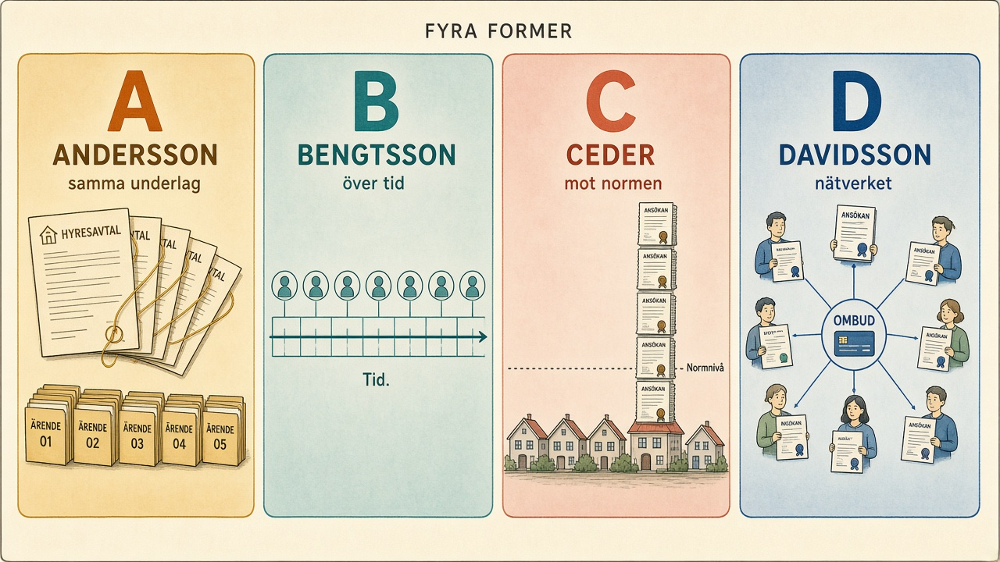

# Försäkringskassans intervju — Controller inom produktionsstyrning

> Här skedde en uppdatering 2026-09-22: live-sidan och `index.html` ligger överst, på samma sätt som för vårdköerna.

- **Live:** [https://kentlundgren.github.io/Grok/intervju/Forsakringskassan_202609/](https://kentlundgren.github.io/Grok/intervju/Forsakringskassan_202609/)
- **Sidan:** [index.html](index.html)

> Underlag för att förbereda intervjun till [Controller till Bidragsbrottsavdelningens stab](https://vakanser.se/jobb/controller+till+bidragsbrottsavdelningens+stab+malmo/) på Försäkringskassan. Fokus: produktionsstyrning och att upptäcka bidragsfusk hos sökande — inte hos handläggare.

> Här skedde en uppdatering 2026-09-22: öppna [index.html](index.html) i webbläsaren. Den bygger på `Talepunkter_260922.html`, som är oförändrad, och har ett eget kort för de fyra formerna av bidragsfusk.

## Så väljer du svar

| Om de frågar | Kort |
|---|---|
| Erfarenhet av produktionsstyrning | [1. Bakgrund](index.html#tp-1) |
| Vad rollen är, vad du kan bidra med | [2. Produktionsstyrning](index.html#tp-2) |
| Ett konkret exempel på fusk i data | [A–D. Bidragsfusk hos sökande](index.html#tp-abcd) |
| SAS Viya | [3. Teknikskiftet](index.html#tp-3) |
| Utbildning, licentiaten | [4. Avhandlingen](index.html#tp-4), och [4b](index.html#tp-4b) bara om de frågar om kalkyler |
| AI | [5. Generativ AI](index.html#tp-5) |
| Vad du har testat | [6. Det du undersökt](index.html#tp-6) |
| Din fråga till dem | [7. Fråga tillbaka](index.html#tp-7) |

A–D gäller sökande. Talepunkt 1 gäller fel hos handläggare.

>

> Minnesbilden nedan visar fyra former av bidragsfusk:

---

## 1. Minnesramen: A, B, C, D

Fyra bedragare, fyra spår. Håll dem i den ordningen — det är lättast att minnas.

### A — Andersson: upprepad registrering
Samma aktör skapar flera ärenden på samma underlag. Samma person, samma hyreskontrakt, samma inkomstuppgift — men i två, fem eller tio separata ärenden. Spåret: **datamatchning** (personnummer, bankkonto, adress, ombud).

> OBS: ordet "dubbelregistrering" är missvisande — det handlar inte om exakt två, utan om att samma underlag dyker upp mer än en gång. Bättre att säga *upprepad registrering* eller *samma underlag i flera ärenden*.

### B — Bengtsson: återkommande mönster
Samma person (eller familj) upprepar samma typ av ansökan över tid — till exempel sjukskrivningar med jämna mellanrum utan verklig sjukdom. Spåret: **sekvensanalys** över tid.

### C — Ceders stadsdel: orealistiska volymer
En hel grupp, ett område eller en kategori genererar ärenden i en takt som avviker från sin egen baslinje — utan delat underlag. Varje person kan ha helt egna, korrekta underlag, men kollektivet sticker ut. Spåret: **trend- och tröskelanalys** mot en norm.

> Normen behöver inte vara geografisk. Den kan vara individuell: en läkare (Cedersson) som skriver femhundra intyg istället för femtio. Samma metod, annan referenspunkt.

### D — Davidsson: nätverksanalys
Flera sökande som är sammanknutna via delad infrastruktur — utan att volymen eller underlaget i sig sticker ut. En enskild person syns inte, men tio personer som delar infrastruktur gör det. Spåret: **kartlägga kopplingar** mellan aktörer.

> **Vad delar de egentligen?** Sällan telefon eller adress — det är för uppenbart. Det som delas är det som är *nödvändigt*: samma **ombud** som lämnar in ansökningarna, samma **bankkonto** som tar emot utbetalningarna, samma **läkare** som skriver intygen, eller samma telefon som ringer in till handläggaren. Det är den typen av kopplingar nätverksanalysen letar efter.

> Används ofta som sista steg: när A är bekräftat men du inte vet om det är tio enskilda misstag eller ett organiserat nätverk.

### Skillnaderna mellan A, C och D
- **A** spårar en tråd genom flera ärenden — samma underlag, flera ärenden.
- **C** mäter en avvikelse mot en norm — många ärenden, inget delat underlag.
- **D** kartlägger en koppling mellan aktörer — ingen avvikelse i volym, men ett nätverk.
- Antalet avgör inte vilken det är. Enheten gör det: underlag (A), norm (C), koppling (D).
- **D är inte en variant av C.** C mäter en enhet mot en norm; D mäter kopplingar mellan enheter. Du kan ha helt normal volym men ett tydligt nätverk — då ser C ingenting och D ser allt.

---

## 2. Korsvalidering — skilja äkta från konstlat

En äkta influensaepidemi ger en äkta topp i sjukskrivningarna och ska inte flaggas. Skillnaden ligger i signaturen:

| | Äkta epidemi | Bedrägerivåg |
|---|---|---|
| Sjukvård/apotek | Ökar i takt | Tyst — ingen motsvarighet |
| Säsong | Följer känd säsong | Ofta utan säsongskoppling |
| Struktur | Sprids i en våg | Koncentrerad till en bidragsform, en läkare, ett nätverk |

Metod: jämför flera oberoende datakällor mot varandra. Ökar sjukskrivningarna men inte apoteken → avvikelse som förtjänar närmare titt.

---

## 3. Övningsfrågor (intervjuträning)

**Fråga 1:** Du har sagt att du är intresserad av produktionsstyrning och att upptäcka missbruk. Kan du ge mig ett konkret exempel på hur du skulle upptäcka bidragsfusk i produktionsdata?

*Bra svar:* Fyra former — A, B, C, D. Andersson (upprepad registrering), Bengtsson (återkommande mönster), Ceders stadsdel (orealistiska volymer), Davidsson (nätverksanalys). Håll dig till sökandesidan.

**Fråga 2:** Hur skulle du skilja en äkta influensaepidemi från organiserat bedrägeri i samma data?

*Bra svar:* Korsvalidering mot oberoende källor — apotek, vårdcentraler, skolfrånvaro. Äkta epidemi syns i alla; bedrägeri bara i en.

**Fråga 3:** Du upptäcker att tio personer i samma postnummer har ansökt om bostadsbidrag med samma hyreskontrakt. Hur resonerar du?

*Bra svar:* Validera först att det verkligen är tio separata ärenden med samma underlag. Sedan nätverksanalys (D) — finns det kopplingar (telefon, konto, ombud)? Därefter till chef. Skillnaden: det är inte samma ärende, det är tio ärenden som döljer samma underlag.

**Fråga 4:** En läkare i ett område skriver plötsligt femhundra sjukintyg på ett halvår, normalt femtio. Vad gör du?

*Bra svar:* Individuell baslinje — Cedersson-läkaren (C). Jämför mot egna historiken och mot patienternas faktiska vårdbesök. Om intygen ökar men vården inte gör det → avvikelse. Därefter nätverksanalys (D) och eskalering.

**Fråga 5 (utmaning):** Varför är nätverksanalys inte bara en variant av orealistiska volymer?

*Bra svar:* C mäter en enhet mot en norm — antal ärenden, antal intyg. D mäter kopplingar mellan enheter — vem som delar telefonnummer, konto, adress. Du kan ha helt normal volym men ett tydligt nätverk; då ser C ingenting och D ser allt. ISF 2018:5 beskriver dem som två skilda metodformer.

**Fråga 6 (utmaning):** Vad delar ett nätverk egentligen — är det inte klumpigt att dela bankkonto?

*Bra svar:* Sällan telefon eller adress — det är för uppenbart. Det som delas är det som är nödvändigt: samma ombud, samma bankkonto, samma läkare, samma inringande telefon. Det är den typen av kopplingar nätverksanalysen letar efter.

---

## 4. Källor

**Primär källa — metodhandbok för de fyra mönstren:**
Försäkringskassan, *Vägledning 2004:1 Kontrollutredning* (version 18). Har en explicit checklista: finns det en systematik som ökar över tid? Har den enskilde lämnat felaktiga uppgifter i andra ärenden? Har den enskilde lämnat olika uppgifter i olika ärenden?
- https://forsakringskassan.se/download/18.7fc616c01814e179a9f6fb/1781091247031/kontrollutredning-vagledning-2004-1.pdf

**Kompletterande — hur kontrollverksamheten fungerar:**
ISF (Inspektionen för socialförsäkringen), *Rapport 2025:14 Kontrollutredningar vid misstänkta bidragsbrott*. Beskriver strategiska profiler och riktade kontroller; profilerade ärenden leder till åtgärd i 74 % av fallen.
- https://isf.se/download/18.64c0dda619afce1ad7d1cbd5/1768374582621/Rapport%202025-14%20Kontrollutredningar%20vid%20misst%C3%A4nkta%20bidragsbrott.pdf

**Nätverksanalys som egen metod — ISF 2018:5:**
ISF, *Profilering som urvalsmetod för riktade kontroller* (2018:5). Beskriver nätverksanalys som en hypotesdriven metodform som letar efter kopplingar mellan personer — till skillnad från statistiska riskmodeller som skattar sannolikhet per ärende.
- https://isf.se/download/18.6e75aae16a591304896b99/1565330421562/Profilering%20som%20urvalsmetod%20fo%CC%88r%20riktade%20kontroller-ISF-Rapport%202018-05.pdf

**Lägesrapport — bidragsbrott inom sjukpenning:**
Försäkringskassan, *Lägesrapport 2026:2*.
- https://www.forsakringskassan.se/download/18.6824ccfb19c0e5392cdea/1772457894135/bidragsbrott-sjukpenning-forsakringskassans-lagesrapport-2026-2.pdf

**Riskprofiler och behandling av personuppgifter:**
- https://www.forsakringskassan.se/om-forsakringskassan/behandling-av-personuppgifter

---

## 5. Rollens kontext

Tjänsten ligger på den nya **Bidragsbrottsavdelningen** (startad februari 2026), inte på den övergripande Ledningsstöd och analys. Produktionsstyrning handlar här om att styra utredningsflöden — kapacitet, beslutstakt, mönster i ärendehanteringen — inte om tillverkning. Samma verktygslåda som myndighetens totala produktionsstyrning, men ett annat organisatoriskt hem och ett annat uppdrag.

Annonsen: [Controller till Bidragsbrottsavdelningens stab, Malmö](https://vakanser.se/jobb/controller+till+bidragsbrottsavdelningens+stab+malmo/).

---

## 6. Filerna i mappen

> Här skedde en uppdatering 2026-09-22: filnamnen blev blob-länkar till GitHub, så varje fil går att öppna direkt från listan.

| Fil | Innehåll |
|---|---|
| [index.html](index.html) | Sidan att öppna: talepunkterna 1–7 och kortet A–D |
| [README.md](https://github.com/kentlundgren/Grok/blob/main/intervju/Forsakringskassan_202609/README.md) | Detta — översikt, ramen, källor, rollens kontext |
| [Talepunkter_260922.html](Talepunkter_260922.html) | Sufflörsidan, oförändrad |
| [Talepunkter_260922.md](Talepunkter_260922.md) | De sju meningarna i markdown |
| [abc-ramen.md](https://github.com/kentlundgren/Grok/blob/main/intervju/Forsakringskassan_202609/abc-ramen.md) | De fyra formerna med exemplen Andersson, Bengtsson, Ceders och Davidsson |
| [ovningsfragor.md](https://github.com/kentlundgren/Grok/blob/main/intervju/Forsakringskassan_202609/ovningsfragor.md) | Sex övningsfrågor med svar, för intervjuträning |
| [checklista.md](https://github.com/kentlundgren/Grok/blob/main/intervju/Forsakringskassan_202609/checklista.md) | Checklista att ha framför sig på vägen till intervjun |
| [annonser.md](https://github.com/kentlundgren/Grok/blob/main/intervju/Forsakringskassan_202609/annonser.md) | De två annonserna sida vid sida, med länkar som bevaras över tid |
| [flashcards.md](https://github.com/kentlundgren/Grok/blob/main/intervju/Forsakringskassan_202609/flashcards.md) | Flashcards — framsida/baksida för att öva på minnet |
| [ett-minuts-pitch.md](https://github.com/kentlundgren/Grok/blob/main/intervju/Forsakringskassan_202609/ett-minuts-pitch.md) | En minuts pitch om varför du vill ha rollen |
| [fyra-former.png](https://github.com/kentlundgren/Grok/blob/main/intervju/Forsakringskassan_202609/Bilder/fyra-former.png) | Minnesbild av de fyra formerna: Andersson, Bengtsson, Ceder, Davidsson |

> **Tips:** Börja med [flashcards.md](https://github.com/kentlundgren/Grok/blob/main/intervju/Forsakringskassan_202609/flashcards.md) på bussen till intervjun. Avsluta med [ett-minuts-pitch.md](https://github.com/kentlundgren/Grok/blob/main/intervju/Forsakringskassan_202609/ett-minuts-pitch.md) så du har orden klara.
